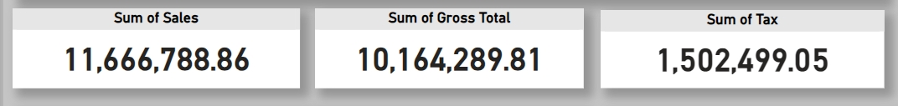
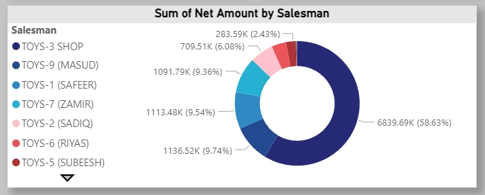
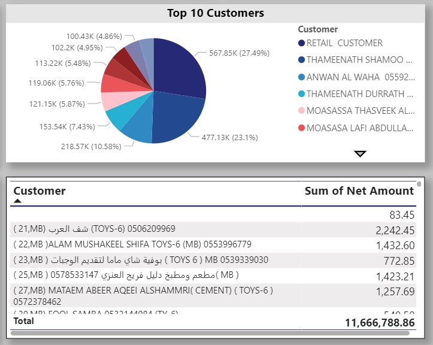
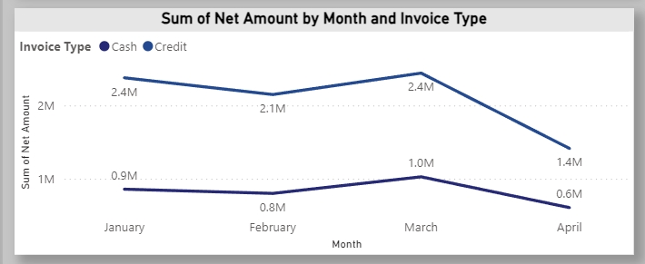
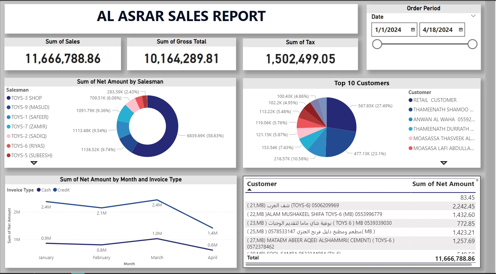

# Al Asrar Sales Report Dashboard

## Overview
This Power BI dashboard provides comprehensive insights into sales performance, helping stakeholders analyze key metrics such as revenue, tax, customer contributions, and salesperson performance. The interactive visualizations empower data-driven decision-making.

---

## Key Features

### 1. **Sales Metrics Overview**
- Provides a snapshot of total sales, gross total, and taxes.
- Enables quick financial assessment for the selected date range.

---

### 2. **Sales by Salesperson**
- Visualizes the contribution of each salesperson to the total net amount using a pie chart.
- Highlights top-performing sales representatives for strategic planning.

---

### 3. **Top 10 Customers**
- Displays the top 10 customers based on their contribution to revenue using a pie chart.
- Offers detailed customer information for enhanced engagement.

---

### 4. **Monthly Sales Trends**
- A line chart showing monthly net sales trends split by **Invoice Type** (Cash vs. Credit).
- Assists in identifying seasonal variations and planning for cash flow.

---

### 5. **Interactive Filtering**
- Includes a **Date Slicer** to filter sales data by a specific date range.
- Allows users to drill down and analyze targeted time periods.

---

## Dashboard Preview

---

## Technologies Used
- **Power BI**: For creating dynamic and interactive visualizations.
- **SQL**: For extracting and transforming sales data.
- **Excel**: For initial data organization and cleaning.

---

## Applications
- **Sales Performance Tracking**: Evaluate salesperson contributions and top customers.
- **Revenue Analysis**: Monitor overall sales, taxes, and net amounts.
- **Strategic Planning**: Support business growth through actionable insights.
